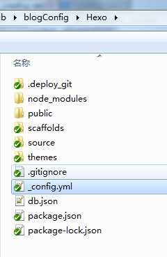
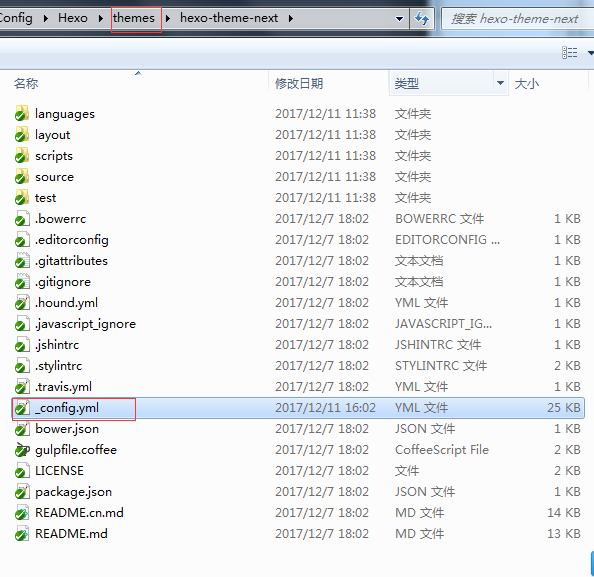
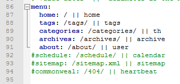
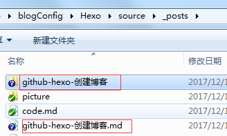
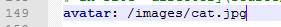

# 工具
1. git
2. node.js

# 步骤
1. 安装git
  官网下载安装  [git](https://git-scm.com/downloads)
2. 安装node.js
  官网下载安装  [node.js](https://nodejs.org/en/)
3. 使用git bash 安装hexo
```
$npm install -g hexo
```
4. 新建一个文件夹Hexo初始化站点
```
$hexo init
```
5. hexo 部署

最重要的是站点部署
```
deploy:
  type: git
  repo:   https://github.com/Lheartbeat/blog.git
  branch: master
```
6. 主题设置
下载 [hexo-theme-next](https://github.com/iissnan/hexo-theme-next.git)，解压放在themes文件夹中


菜单设置


# hexo的常用指令
1. hexo n "xx" #hexo new "postname" 新建博客，在\Hexo\source\_posts里新建一个xx.md文件
如果安装了hexo-asset-image 则同时会生成一个xx的文件夹

资源文件可以放在文件夹中如图片等，使用相对路径即可。
```

```

2. hexo g #hexo generate #生成静态页面至public目录
3. hexo s #hexo server #开启预览访问端口（默认端口4000，'ctrl + c'关闭server）
4. hexo d #hexo deploy #部署到GitHub
5. hexo help  # 查看帮助
6. hexo version  #查看Hexo的版本
7. hexo s -g #生成并本地预览
8. hexo d -g #生成并上传

# 细微之处
## 设置头像
修改themes/hexo-theme-next中的——config.yml中的avatar:字段


## markdowm显示图像
方式1：
```

```
方式2：
```

```
<font color=#0099ff size=5 face="黑体">特别注意</font>

图片的路径是相对路径。是相对xxx.md文件的路径

比如
- picture.md 文件的路径  E:\GitHub\blogConfig\Hexo\source\_posts\picture.md

- panda.png文件的路径  E:\GitHub\blogConfig\Hexo\source\image\panda.png

- 在picture.md文件中使用panda.png图片的路径是../image/panda.png
```

```
