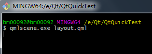
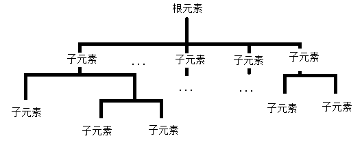

# qml简介
  `QML`是一种描述性的脚本语言，文件格式以`.qml`结尾。语法格式非常像`CSS`，但又支持`javacript`形式的编程控制。它结合了`QtDesigner UI`和`QtScript`的优点。`QtDesigner`可以设计出`.ui`界面文件,但是不支持和Qt原生C++代码的交互。`QtScript`可以和`Qt`原生代码进行交互，但是有一个缺点，如果要在脚本中创建一个继承于`QObject`的图形对象非常不方便，只能在`Qt`代码中创建图形对象，然后从 `QtScript`中进行访问。而`QML`可以在脚本里创建图形对象，并且支持各种图形特效，以及状态机等，同时又能跟`Qt`写的`C++`代码进行方便的交互，使用起来非常方便。


可以使用Qt自带的工具`qmlscene.exe` 直接运行qml文件查看qml界面效果


# qml的基本元素

- item
- window
 导入`import QtQuick.Window 2.2`模块，2.2是Qt模块的版本号

- image

- 菜单
## 注释符和C++一样
```
 /* 这是一个多行注释
 和c语言的一样 */

// 一个单行注释
```

# qml的布局
要使用QML进行界面的布局，首先需要理解QML元素的层次结构。QML的层次结构很简单，是一个树形结构，最外层必须有一个根元素，根元素里面可以嵌套一个或多个子元素，子元素里面还可以包含子元素。如果用图形画出来的话大概是这个样子。
 

    anchor layout    


# qml与C++的交互

[官方文档](http://doc.qt.io/qt-5/qtqml-cppintegration-topic.html)

Qml文档：
通过已有元素拼装新的控件元素
UI布局 + UI动画 + UI状态和简单逻辑
C++ ：
Qml文档对应一个controller，一个model（可以不断分层，多个controller 多个model)
Qml 里的UI数据通过属性绑定从model获取
Qml 里的UI事件通过controller响应


# 一些网址

[qml中文资料](https://github.com/cwc1987/QmlBook-In-Chinese)

[qml英文资料](http://qmlbook.github.io/index.html)

[五子棋](http://quitcoding.com/download/Qt_Quick_Game_Programming_1_0.pdf)

[Qt Quick 之 QML 与 C++ 混合编程详解](http://blog.csdn.net/foruok/article/details/32698603)
