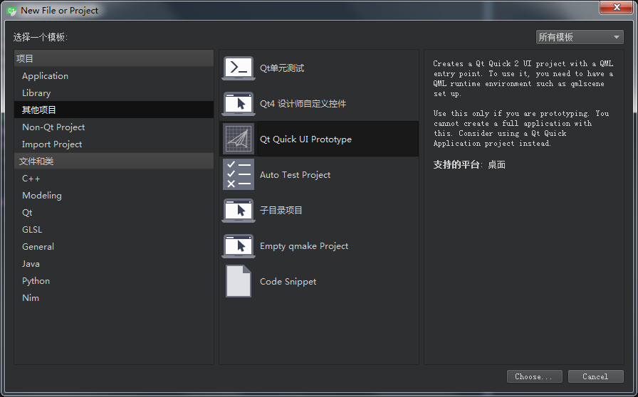
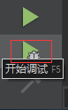
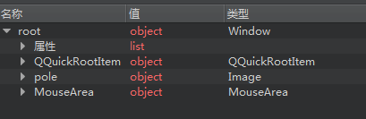
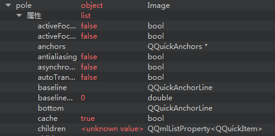
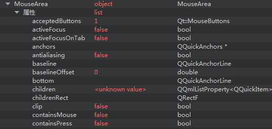

# qml简介
  `QML`是一种描述性的脚本语言，文件格式以`.qml`结尾。语法格式非常像`CSS`，但又支持`javacript`形式的编程控制。它结合了`QtDesigner UI`和`QtScript`的优点。`QtDesigner`可以设计出`.ui`界面文件,但是不支持和Qt原生C++代码的交互。`QtScript`可以和`Qt`原生代码进行交互，但是有一个缺点，如果要在脚本中创建一个继承于`QObject`的图形对象非常不方便，只能在`Qt`代码中创建图形对象，然后从 `QtScript`中进行访问。而`QML`可以在脚本里创建图形对象，并且支持各种图形特效，以及状态机等，同时又能跟`Qt`写的`C++`代码进行方便的交互，使用起来非常方便。


可以使用Qt自带的工具`qmlscene.exe` 直接运行qml文件查看qml界面效果


# qml的基本元素
Item（基础元素对象）是所有可视化元素的基础对象，所有其它的可视化元素都继承自Item。它自身不会有任何绘制操作，但是定义了所有可视化元素共有的属性：

| 分组 | 	属性 |
| -- | -- |
| Geometry（几何属性） | x,y（坐标）定义了元素左上角的位置，width，height（长和宽）定义元素的显示范围，z（堆叠次序）定义元素之间的重叠顺序。 |
| Layout handling（布局操作）| anchors（锚定），包括左（left），右（right），上（top），下（bottom），水平与垂直居中（vertical center，horizontal center），与margins（间距）一起定义了元素与其它元素之间的位置关系。 |
| Key handlikng（按键操作） | 附加属性key（按键）和keyNavigation（按键定位）属性来控制按键操作，处理输入焦点（focus）可用操作。 |
| Transformation（转换） | 缩放（scale）和rotate（旋转）转换，通用的x,y,z属性列表转换（transform），旋转基点设置（transformOrigin）。 |
| Visual（可视化） | 不透明度（opacity）控制透明度，visible（是否可见）控制元素是否显示，clip（裁剪）用来限制元素边界的绘制，smooth（平滑）用来提高渲染质量。 |
| State definition（状态定义） | states（状态列表属性）提供了元素当前所支持的状态列表，当前属性的改变也可以使用transitions（转变）属性列表来定义状态转变动画。 |


## 可以通过`Qt creator`的调试状态查看元素的属性
1. 新建一个qml工程
在 __文件__  __新建文件或项目__ 对话框中，选择 __其他项目__,然后选择 __Qt Quick UI Prototype__

例如以下Qml代码的属性
```js
import QtQuick 2.8
import QtQuick.Window 2.2

Window {
    id: root
    property int blurRadius: 0
    Image {
        id: pole
        anchors.horizontalCenter: parent.horizontalCenter
        anchors.bottom: parent.bottom
        source: "images/pole.png"
    }
    MouseArea {
        anchors.fill: parent
        onPressed: {
            wheel.rotation += 90
            root.blurRadius = 16
        }
        onReleased: {
            root.blurRadius = 0
        }
    }
}
```
2. 启动调试

3. 属性列表

4. image的属性

5. 鼠标区域的属性


6. qml必须导入 `QtQuick` ,导入方式`import QtQuick 2.8`
使用Qt已有的组件需要导入相应的模块
如使用`Window` 导入`import QtQuick.Window 2.2`模块，2.2是Qt模块的版本号

## qml注释符和C++一样
```
 /* 这是一个多行注释
 和c语言的一样 */

// 一个单行注释
```

# qml的布局
要使用QML进行界面的布局，首先需要理解QML元素的层次结构。QML的层次结构很简单，是一个树形结构，最外层必须有一个根元素，根元素里面可以嵌套一个或多个子元素，子元素里面还可以包含子元素。如果用图形画出来的话大概是这个样子。
 

使用`anchor`进行布局    


# qml与C++的交互

qml与C++交互的桥梁是 __QML引擎和元对象系统__

[官方文档](http://doc.qt.io/qt-5/qtqml-cppintegration-topic.html)

`qml` 跟`C++` 的交互方式主要有以下几种：

1. 以直接在C++应用程序中加载qml文件，拿到界面各元素的指针，修改界面属性 __(在C++中，加载qml文件)__

2. 可以将C++对象expose 到qml中，然后在qml文件中访问该对象的属性或调用对象的方法 __(在qml中，访问C++对象并调用C++方法)__

3. 可以自定义C++类，把该类注册给qml类型系统，然后可以像其他内置类型那样在qml中使用 __(在qml中，使用导入的C++ 类型)__


qml与C++结合的优势：

- 界面与逻辑完美分离：用QML来定义界面，用C++来实现界面的响应逻辑。
- 通常的做法是，当用户在界面上操作的时候，我们从qml文件里面调用C++的响应函数。
- 应用MVC方便：用QML来描绘界面(View)，用C++代码来实现Model 和 Controller。
- 自定义控件容易：可以用C++来自定义自己的QML类型， 然后将它应用于我们的应用程序中。
- 可以在程序运行时访问或修改QML对象的属性进而改变界面的显示


# 一些网址
[官方教程](http://doc.qt.io/qt-5/qmlapplications.html)


[qml中文资料](https://github.com/cwc1987/QmlBook-In-Chinese)

[qml英文资料](http://qmlbook.github.io/index.html)

[五子棋](http://quitcoding.com/download/Qt_Quick_Game_Programming_1_0.pdf)

[Qt Quick 之 QML 与 C++ 混合编程详解](http://blog.csdn.net/foruok/article/details/32698603)
